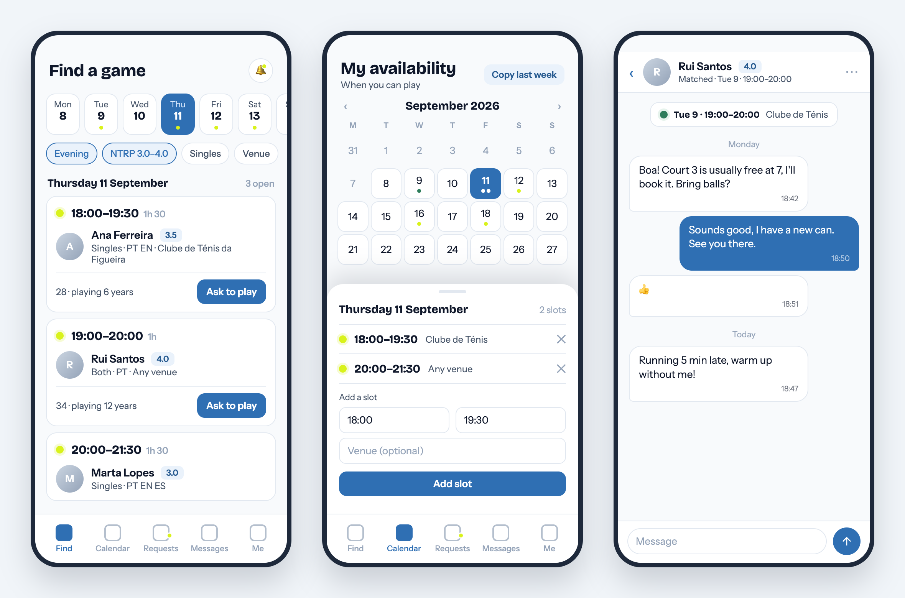
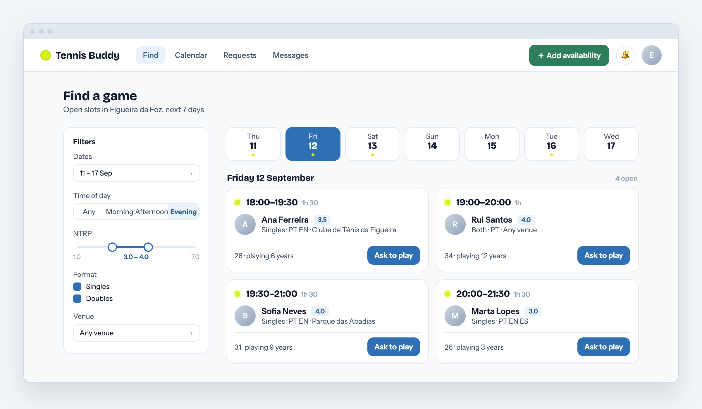

# 🎾 Tennis Buddy Finder

> **Work in progress.** The product and visual design are settled and the backend is being built. There is no usable app yet. Everything below describes where this is headed.

Find someone to play tennis with, at your level, when you are free. Amateur players publish the times they can play, browse who else is free at a similar level nearby, and arrange a match through in-app chat. Launching in **Figueira da Foz, Portugal**, built so more cities can be added without changing the data model.

## What it will look like

Design mockups from the approved visual spec. The app follows a "Hard Court" palette: court blue for actions, surround green for matched, and tennis-ball yellow used for exactly one thing, an open slot.

<p align="center">
  
</p>

<p align="center">
  
</p>

## How it works

1. **Set your availability.** Concrete time slots on a month calendar, in 30-minute steps, with an optional venue. "Copy last week" for regulars.
2. **Find a game.** Search open slots for the next 7 days, filtered by time of day, NTRP level, format and venue. Results are grouped by day.
3. **Ask to play.** Send a request on a slot with an optional message. The owner accepts or declines.
4. **Chat and meet.** Accepting opens a private conversation with the matched slot pinned at the top. No phone numbers are stored or shared.
5. **Stay safe.** Block and report from day one. Email and in-app notifications for requests and messages.

Skill level is self-declared NTRP (1.0 to 7.0). Minimum age is 18. Sign in with email and password (verified), Google, or Facebook.

## Status

| Area | State |
| --- | --- |
| Product spec | Done |
| Visual design | Done, mockups above |
| Backend: schema, availability, search, requests, chat, blocks, reports, notifications | In progress |
| Auth (Better Auth on Convex) and email (Resend) | Planned |
| Frontend (Nuxt UI) | Planned |
| Deployment to Cloudflare | Scaffolded |

## Stack

| Layer | Choice |
| --- | --- |
| Frontend | [Nuxt 4](https://nuxt.com) + [Nuxt UI v4](https://ui.nuxt.com) + Tailwind CSS v4 |
| Backend | [Convex](https://convex.dev): reactive database, functions, crons, file storage |
| Auth | [Better Auth](https://www.better-auth.com) via the official Convex component |
| Email | [Resend](https://resend.com) via the official Convex component |
| Validation | Zod v4 schemas shared between backend and frontend |
| Tooling | pnpm workspaces, [Vite+](https://viteplus.dev), Oxlint + Oxfmt, TypeScript |
| Hosting | Cloudflare via [Alchemy](https://alchemy.run) |

## Project structure

```
tennis-buddy-finder/
├── apps/
│   └── web/            Nuxt 4 app (app/ directory, Nuxt UI, Convex composables)
├── packages/
│   ├── backend/        Convex schema, functions, crons, tests
│   ├── env/            Validated environment variables for web and backend
│   ├── config/         Shared tsconfig
│   └── infra/          Alchemy deployment (Cloudflare)
└── docs/
    └── images/         README assets
```

## Getting started

Requires a current Node LTS and pnpm (the pnpm version is pinned in `package.json`).

```bash
pnpm install
```

Create the Convex project and link it (follow the prompts):

```bash
pnpm run dev:setup
```

Copy the Convex URL it writes to `packages/backend/.env.local` into `apps/web/.env` as `NUXT_PUBLIC_CONVEX_URL`, then run everything:

```bash
pnpm run dev
```

The web app is at [http://localhost:3001](http://localhost:3001) and connects to your Convex dev deployment.

### Scripts

| Command | What it does |
| --- | --- |
| `pnpm run dev` | Backend and web in development mode |
| `pnpm run dev:web` | Web app only |
| `pnpm run dev:server` | Convex backend only |
| `pnpm run build` | Build all packages |
| `pnpm run check-types` | TypeScript across the workspace |
| `pnpm run check` | Lint and format (Oxlint, Oxfmt) |
| `pnpm run deploy` | Deploy to Cloudflare through Alchemy |

## Deployment

Alchemy deploys the web app to Cloudflare. Configure the provider once with `pnpm exec alchemy login --configure` inside `packages/infra`. Deploys are staged and default to a personal `dev_<username>` stage; production is an explicit stage:

```bash
cd packages/infra && pnpm exec alchemy deploy --stage production
```

## Contributing

This is a personal project and not open to contributions yet. Issues and ideas are welcome once the first version is running.

## License

Not yet decided.